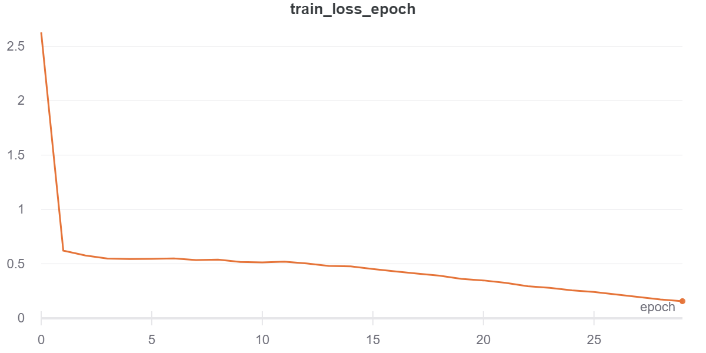
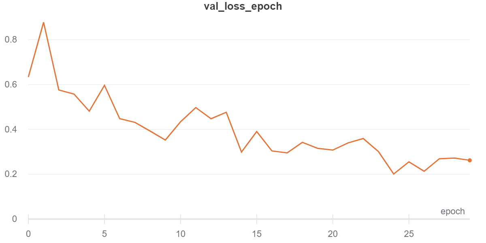

# end-to-end-driving

Repository to train end-to-end neural nets on the [comma2k19 dataset](https://github.com/commaai/comma2k19).

## Environment setup
Setup a conda environment with the libraries specified in requirements.txt

## Dataset setup
1. Download the dataset from [here](https://academictorrents.com/details/65a2fbc964078aff62076ff4e103f18b951c5ddb) using the wget command and then run a command-line torrent client on the downloaded file to download the full dataset (I used rTorrent). The directory structure should be the root directory with all the Chunk folders directly below.
2. Run the pre-processing script as follows. Chunk range is set to 3-10 by default (Civic). Set to 1-2 for Rav4.
```bash
python preprocess_dataset.py <path_to_comma2k19_folder> --chunk_range <first_chunk> <last_chunk> --frame_size <width> <height>
```
This script groups all data into folders corresponding to routes instead of having chunks and segments. For each route, it resizes and saves all image frames as jpgs and saves numpy arrays for each route corresponding to global pose frame times, frame positions, frame velocities, and frame orientations as well as synced CAN bus speeds and steering angles. The CAN bus data is to be used as labels for end-to-end control and the global pose data is to be used to generate paths for end-to-end planning labels.

## Generate train/val/test lists
Specify the routes to be used for the test set in data/dataset_lists/test_set_routes.json. Then, run the split_dataset script to generate the file splits for the training and validation sets:
```bash
python data/split_dataset.py <path_to_preprocessed_dataset> -f <number_of_future_steps> -p <number_of_past_steps> -d <dataset_size> -m <max_bin_size> -b <number_of_bins> -s <trainval_split>
```
This script will filter out paths where the car goes backwards and has an average speed of less than 10 m/s. Then it calculates a curvature score for the path based on the steering angle throughout the path. The final dataset is sampled in such a way that the dataset is more balanced based on this curvature score.

## Training
To train, simply run training script with the argument being the path to the config file under the configs directory. The config used to train the final model is configs/resnet34_sequence.json:
```bash
python train.py <path_to_config>
```

## Logging
All logging was done through Weights and Biases. See the final loss curves below:  




## Example predictions on test set


## Future Things To Try
- Bigger and better backbone (ConvNext, EfficientNetV2, ...) using timm
- More hyperparameter tuning -> wandb sweep
- Try longer sequences using lstm
- Write a script to display predictions on validation set by order of highest loss
- Weigh path points from later timesteps more than later since they are more difficult
- Initialize the final fc layer to the mean of all the labels to avoid hockey stick loss
- Use a lane detection model to remove lane changes
- Or train a classifier to identify sections where we are making lane changes, left turns, right turns, etc... to label desire
- Try experimenting with L1/L2 loss and gradient L1/L2 loss
- Try adding more data aug (lens distortion, noise) -> maybe switch to albumentations (MotionBlur, GaussNoise, ColorJitter, )
- Predict distributions using a gaussian misture model (GMM) -> mixture density networks (https://github.com/sagelywizard/pytorch-mdn)
- https://deep-and-shallow.com/2021/03/20/mixture-density-networks-probabilistic-regression-for-uncertainty-estimation/
- Try sequence model to predict each timestep individually (see https://storage.googleapis.com/waymo-uploads/files/research/MotionPred/MotionPrediction_MTRA.pdf)
- Predict each timestep relative to previous timestep (predict delta vector at each timestep) instead of full path. Smaller overall magnitude of predictions -> more stable learning, can initialize single bias for seq model.
- Try training world models for simulation

## New dataset
- Predict 30 frames in the future (1.5 seconds @ 20 fps)
- Try no past frames to start, then try 2, 4, 8
- No test set, just set aside some routes for val set
- Use full dataset (might have to balance by curvature)
